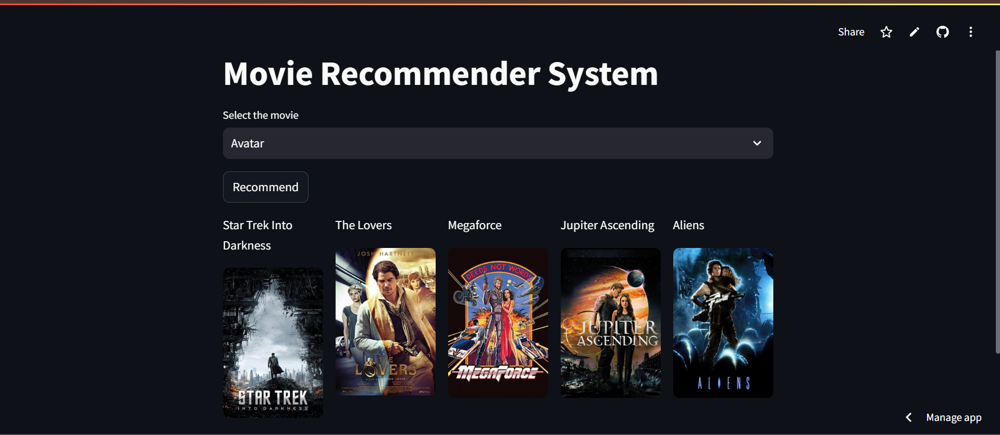

# Movie Recommender System

This is a simple movie recommendation system built using Streamlit. It suggests similar movies based on the selected movie and displays their posters.



## Features
- Select a movie from a predefined list.
- Get five movie recommendations based on similarity.
- Fetch movie posters using The Movie Database (TMDb) API.


## Installation

1. Clone the repository:
   ```sh
   git clone https://github.com/your-repo/movie-recommender.git
   cd movie-recommender
   ```
2. Create and activate a virtual environment:
   ```sh
   python -m venv venv
   ```
   - **Windows (CMD):**
     ```sh
     venv\Scripts\activate
     ```
   - **Windows (PowerShell):**
     ```sh
     venv\Scripts\Activate.ps1
     ```
   - **macOS/Linux:**
     ```sh
     source venv/bin/activate
     ```
3. Install the required dependencies:
   ```sh
   pip install -r requirements.txt
   ```
4. Download the required files:
   - Ensure `movies_dict.pkl` is present in the directory.
   - The similarity matrix is downloaded from Hugging Face Hub.

## Running the App

Run the following command:
```sh
streamlit run app.py
```

## API Key
add API key to the .env file
```python
response = requests.get(f"https://api.themoviedb.org/3/movie/{movie_id}?api_key=YOUR_API_KEY&language=en-US")
```

## How It Works
1. Loads the precomputed similarity matrix.
2. Uses cosine similarity to find the most similar movies.
3. Fetches movie posters from TMDb API.
4. Displays the recommendations with their posters in a 5-column layout.

## Recommendation Systems
A recommendation system is an algorithm that suggests items to users based on various factors.

### Types of Recommendation Systems:
1. **Content-Based Filtering**
   - Recommends items similar to what the user has liked before.
   - Example: Similarity of content, based on tags, genres, descriptions.

2. **Collaborative Filtering**
   - Recommends items based on the behavior of similar users.
   - Example: Users who liked similar movies will get recommendations based on other users' preferences.

3. **Hybrid Recommendation System**
   - Combines content-based and collaborative filtering methods.
   - Example: Uses both item similarity and user behavior for better recommendations.

## Resources for Further Work
- [Streamlit Documentation](https://docs.streamlit.io/)
- [Hugging Face Hub](https://huggingface.co/)
- [The Movie Database API](https://www.themoviedb.org/documentation/api)
- [Python Virtual Environments](https://docs.python.org/3/library/venv.html)

## App Workflow
1. User selects a movie from the dropdown.
2. The app computes similarity scores and retrieves similar movies.
3. Movie posters are fetched using TMDb API.
4. The app displays five recommended movies along with posters.

## Live Demo
Check out the live demo of the app:
[Film Reflex](https://film-reflex.streamlit.app/?embed_options=show_footer)

## App Preview


## Acknowledgments
- [Streamlit](https://streamlit.io/)
- [TMDb API](https://www.themoviedb.org/)
- [Hugging Face Hub](https://huggingface.co/)

## License
This project is licensed under the MIT License.

